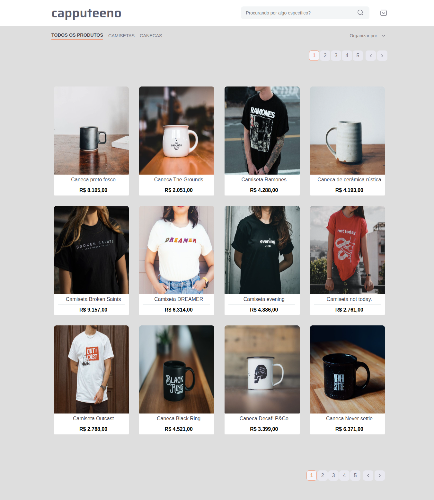
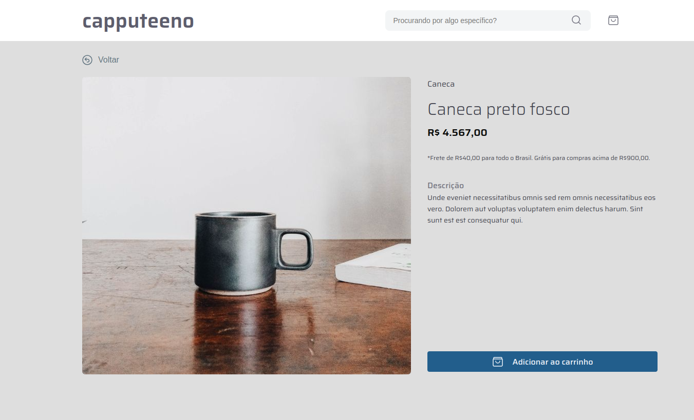
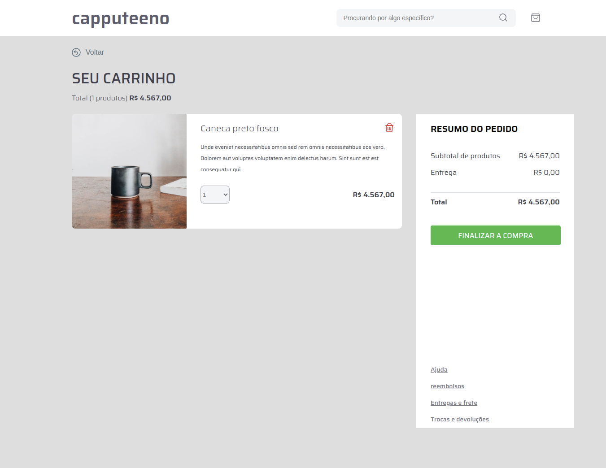

# E-COMMERCE;

## Começando.

Bem-vindo ao E-commerce! Este projeto é um site de comércio eletrônico de produtos, desenvolvido com NextJS. Nele, você encontrará camisetas e canecas. O site permite que você visualize os detalhes do produto, adicione produtos ao carrinho, navegue através da paginação de produtos e utilize filtros para encontrar exatamente o que deseja.

## Funcionalidades Principais.

- Paginação: Implementei a funcionalidade de paginação diretamente no aplicativo, sem a necessidade de utilizar bibliotecas externas. Isso permite que você navegue facilmente entre os produtos disponíveis.

- Ordenação: É possível ordenar os produtos por preço, do maior para o menor, do menor para o maior, por novidades ou mais vendidos.

- Filtros: Você pode utilizar filtros para exibir apenas camisetas, apenas canecas ou todos os produtos.

- Detalhes do produto: É possível visualizar os detalhes de cada produto, como descrição e preço.

- Carrinho de compras: Você pode adicionar e remover produtos do carrinho, ajustar as quantidades desejadas e visualizar um resumo do seu pedido.

## 📋 Pré-requisitos

Para você rodar o projeto em sua maquina local você necessita ter essas tecnologias já instaladas ou você pode instalar:

- NodeJs: você pode instalar ([clicando aqui](https://nodejs.org/en/download/)).

- Yarn: você pode instalar o yarn ([clicando aqui](https://classic.yarnpkg.com/lang/en/docs/install/#debian-stable)).

## Executando o projeto em seu ambiente de desenvolvimento

Siga as etapas abaixo para executar o projeto em seu ambiente de desenvolvimento:

# 1. Instale as dependências

Entre no diretório "frontend", execute o seguinte comando para instalar as dependências necessárias:

```
yarn install
```

# 2. Inicialize o projeto

Para inicializar o projeto, utilize o seguinte comando:

```
yarn dev
```

Agora você pode acessar a aplicação na sua maquina local.

## Demostração do APP:

<p>- Catálogo da loja:<p>


<br><br>

<p>- Página do produto:<p>


<br><br>

<p>- Página do carrinho:<p>


<br><br>

## ✒️ Autor

- [Mateus](https://github.com/mateusfelixdias).
